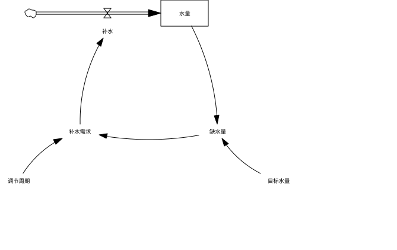
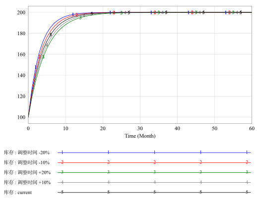

# Vensim System Dynamics Skill

[简体中文](README.md) · [English](README.en.md)

A reusable Agent Skill for editable Vensim `.mdl` models, native sketch repair, reproducible simulation, calibration, policy optimization, and Python publication figures. New models use Chinese business variable names and circular feedback layouts by default. Windows, macOS, and Linux share the same Python implementation. MCP is optional.

**Final model structure figures must be exported or captured from the actual delivered MDL opened in native Vensim.** Graphviz may suggest node positions; a generated geometry preview does not qualify as a final model diagram. This project is independent of Ventana Systems and is not an official or certified Vensim product.

**Author: 传康KK（万能程序员）. Commercial use is prohibited.** Follow the [non-commercial license](LICENSE) and retain attribution and license notices when redistributing. Attribution belongs in documentation rather than over model figures.

[Installation](#installation) · [Skill structure](#skill-structure-and-discovery) · [Native diagrams](#native-diagram-rules) · [Feedback](#polarity-and-feedback-loops) · [Figures](#python-publication-figures) · [Simulation](#simulation-and-experiments) · [Optimization](#calibration-and-policy-optimization) · [MCP](#agent-and-mcp-integration) · [Development](#validation-and-development)

## Skill structure and discovery

```text
vensim-system-dynamics-skill/
├── README.md / README.en.md          Chinese and English repository guides
├── LICENSE                          Non-commercial license
├── pyproject.toml                   Machine-readable version and Ruff rules
├── docs/DEVELOPMENT.md              Portable development and release notes
├── pyproject.toml                   Shared Ruff lint and format rules
├── .github/workflows/validate.yml   Platform and optional integration checks
├── docs/                            Audit records and native example exports
├── tests/                           Parsing, geometry, simulation, and MCP tests
└── skills/vensim-skill/              Self-contained, installable Skill
    ├── SKILL.md                     Standard Skill entry point
    ├── LICENSE                      License included in distribution
    ├── skill.sh / skill.cmd         POSIX and Windows launchers
    ├── agents/openai.yaml           UI metadata and default Agent instructions
    ├── scripts/                     Modeling, layout, simulation, and plotting
    ├── references/                  Task-specific manuals and research checks
    ├── assets/templates/            Blank specifications and display settings
    ├── assets/examples/             Demonstrations and format regression models
    └── requirements/                Optional dependencies and constraints
```

The directory name matches `name: vensim-skill` in the YAML frontmatter. Scripts and resources are packaged together and do not depend on a developer's absolute paths. Launchers locate their scripts relative to their own directory; model and output paths are relative to the caller's working directory.

Start a real project with the [blank model specification](skills/vensim-skill/assets/templates/model_template.json). It contains no business parameters. Equations, units, initial conditions, time settings, scenarios, sample counts, and seeds must come from the current task. Demonstration numbers are not fallback inputs.

## Installation

Python **3.10 or newer** is required. Core model checks, conservative layout, model building, and scalar Euler simulation use the standard library. Install optional dependencies only for the capabilities needed.

```bash
npx skills add 1837620622/vensim-system-dynamics-skill --skill vensim-skill
```

GitHub CLI installations that provide `gh skill` can also use:

```bash
gh skill install 1837620622/vensim-system-dynamics-skill vensim-skill --agent codex --scope user
```

For direct use or development:

```bash
git clone https://github.com/1837620622/vensim-system-dynamics-skill.git
cd vensim-system-dynamics-skill/skills/vensim-skill
./skill.sh doctor
```

Windows PowerShell:

```powershell
cd vensim-system-dynamics-skill\skills\vensim-skill
.\skill.cmd doctor
```

All platforms may run `python scripts/skill_cli.py doctor`. Quote paths containing spaces. The following commands assume the current directory is `skills/vensim-skill`; replace example paths with the current project paths.

| Capability | Optional dependency | Installation |
| --- | --- | --- |
| Result figures | Matplotlib | `python -m pip install -r requirements/plots.txt` |
| PySD translation and simulation | PySD | `python -m pip install -r requirements/pysd.txt` |
| Calibration and policy search | SciPy | `python -m pip install -r requirements/analysis.txt` |
| Local stdio MCP | MCP Python SDK 1.x | `python -m pip install -r requirements/mcp.txt` |
| Global position proposals | Graphviz | macOS: `brew install graphviz`; Windows: [official installation](https://graphviz.org/download/), with `dot` on PATH |

Optional requirements reference `requirements/constraints.txt`, including lower bounds for known security fixes. The constraints file does not install packages by itself. An older MCP SDK is rejected at server startup.

Install Vensim through its [official distribution](https://vensim.com/download/) and observe its separate license. Official materials describe the 10.5 release line, and the [conference resources](https://vensim.com/conference/) identify DSS 10.5.2 for the Agent workshop. Native example checks in this repository used macOS PLE 10.5.0. Download pages, release notes, and installed product channels may differ; inspect the actual environment before making compatibility claims.

`doctor` reports Python, optional packages, Graphviz executables, detected native applications, and available plotting fonts. It also checks installed dependencies against `requirements/constraints.txt`, distinguishing missing packages, versions requiring upgrades, and version formats needing review. This is a local constraint check, not a live vulnerability database scan. Export checks the glyphs actually needed by a figure. Python font availability does not prove that native Vensim renders the same names correctly.

## Native diagram rules

- New models use circular feedback layouts by default. Arrange the actual main feedback chain around a ring, keep parameters near their targets, and organize separate modules independently. Keep stocks, valves, clouds, and physical flow pipes as a readable backbone. Do not add relationships to make a circle.
- New information arrows are black. Pure native blue `0-0-255` is an explicit alternative. Physical flow pipes remain black double lines with native valves. Preserve arrowhead, polarity, delay, hide, and font fields when changing appearance.
- New business variables and view names default to Chinese. Use English when requested. Preserve names in existing models and their equation/CSV/script mappings.
- Ordinary one-control-point arrows use native circular geometry. Graphviz splines must not be written as Vensim arcs. Keep unsupported and multi-point routes intact and report them for native review.
- Track each shadow by `(View, object ID)`. Its name refers to a model variable; its coordinates belong to that particular sketch instance. Shadows may have outgoing arrows and must not receive incoming arrows.
- Check text overlap, shadow brackets, line crossings, pipes through text, misplaced labels, and long names. Recheck geometry after font changes.
- Keep necessary polarity and delay markings. Add no debug IDs, generation notes, decorative icons, unsupported loop symbols, author watermarks, or paragraphs of captions inside diagrams.

The [main Skill](skills/vensim-skill/SKILL.md) and [appearance manual](skills/vensim-skill/references/APPEARANCE.md) define the workflow. Geometry reports support review; they cannot guarantee zero crossings for arbitrary networks or replace native visual inspection.

Native circular demonstration, exported from the corresponding real MDL:



[Editable model](skills/vensim-skill/assets/examples/circular_feedback_zh.mdl) · [Demonstration specification](skills/vensim-skill/assets/templates/circular_feedback_zh.json) · [Native checks and hashes](docs/circular_example_verification.json)

| Operation | Default | Configuration |
| --- | --- | --- |
| New model | `build` uses `circular` | `sketch.layout_mode`: `circular`, `refine`, or `preserve` |
| Repair existing model | Local `refine`, preserving existing styles | `--mode circular` for explicit circular rearrangement |
| Spacing and ring shape | Derived from current boxes and graph | `circular_gap`, `circular_aspect`, `node_spacing` |
| Manual positions | Preserve explicit `position` | `node_positions` for unambiguous existing instances |
| Remaining conflicts | Report object IDs and preserve model meaning | Native edits, separate views, or valid shadow references |

Circular layout uses the standard library. It is this Skill's display default, not a requirement imposed by Vensim or a proof of feedback polarity. Conflicting manual anchors remain in place and produce a failed geometry report.

## Building and repairing models

```bash
./skill.sh build model.json --output work/model.mdl
./skill.sh inspect work/model.mdl
./skill.sh audit work/model.mdl
./skill.sh check work/model.mdl
./skill.sh visual work/model.mdl --strict --max-crossings 0
./skill.sh layout existing.mdl --output work/reviewed.mdl --mode refine --style monochrome
```

The builder requires stock initial conditions and units, flow equations and stock endpoints, auxiliary equations, and complete `time` fields. Constants must be finite numeric literals; use `aux` for derived equations. An explicit `position: [x, y]` is available for stocks, auxiliaries, and constants. Flow labels remain attached to their valves.

The builder targets simple scalar SFDs. It does not infer research mechanisms or parameter values, build arbitrary multi-view networks, or implement shared complex piping. Use an existing MDL and native editing for advanced structures. See [input specifications](skills/vensim-skill/references/SPECIFICATIONS.md).

| Layout mode | Behavior | Graphviz required |
| --- | --- | --- |
| `preserve` | Keep nodes; refine supported information arcs | No |
| `refine` | Move local auxiliaries and shadows to nearby free space | No |
| `circular` | Circular organization based on actual connections | No |
| `auto` | Compare original, local, and global position candidates | When movable nodes need a global candidate |
| `graphviz` | Explicit global positions followed by native routing | Yes |

Existing-model style defaults to `preserve`; select `monochrome` for black or `native-blue` for blue information arrows. Layout writes a new MDL and `.mdl.layout_report.json`, preserving the equation bytes, encoding, topology, polarity, and shadow identity. No automatic backup copy is needed because inputs are not overwritten.

`preview` generates debugging material only:

```bash
./skill.sh preview work/reviewed.mdl --compare-with existing.mdl --output debug/geometry.html
```

Open the resulting MDL in native Vensim, inspect every view, run **Check Model** and **Units Check**, then export its structure figure. A geometry `pass` and `native_verified` are separate facts.

## Polarity and feedback loops

```bash
./skill.sh feedback work/model.mdl --spec model.json --output review/feedback.json
./skill.sh feedback work/model.mdl --spec model.json --strict
```

`feedback` checks displayed `+/-/S/O` against supported equation forms and checks declared `feedback_loops` paths and `R/B` parity. Proven conflicts prevent new-model output. Nonlinear, parameter-dependent, or unsupported relations remain pending review. Unmarked arrows are not automatically assigned plus signs.

Link polarity describes direct influence while other inputs are held fixed. Loop polarity depends on the ordered dynamic path and negative-link parity. Initial-condition references do not create dynamic loops. Clockwise rotation does not imply reinforcing feedback, and balancing feedback does not prove stability.

Place link signs near the associated arrowhead in clear space; place R/B within the corresponding loop's open area. Native Vensim also supports handle/arrowhead and inside/outside options. Preserve those native fields and inspect the actual rendered positions. The tool does not automatically place or certify loop glyphs. See the [feedback manual](skills/vensim-skill/references/FEEDBACK.md).

## Python publication figures

Result figures use actual simulation data or supplied CSV files. Defaults are colored curves, a white background, thin grid lines, repeated curve numbers, and a matching bottom legend. Each variable gets a separate figure. **No title, figure number, icon, watermark, or decorative figure collection is added by default.**



This demonstration uses actual Euler output from the included inventory MDL. It is not calibrated research evidence or a source of defaults for other models.

```bash
./skill.sh graph work/model.mdl --var 库存 --output figures/stock.pdf --formats png,svg
./skill.sh simulate work/model.mdl --var 库存 --output results/base.csv --plot figures/base.png
./skill.sh plot-data results/series.csv --var 库存 --output figures/stock.png --dpi 1200
./skill.sh graph work/model.mdl --var 库存 --output figures/stock.png --plot-config my_plot.json
```

| Detail | Behavior |
| --- | --- |
| Raster | PNG at 600 DPI by default; configurable up to 1200 with pixel limits |
| Vector | PDF and SVG; vector line art is not measured by a maximum DPI |
| Fonts | Verify installed families and required glyphs; PDF embeds fonts and SVG outlines them |
| Legend | Scenario names, numbers, colors, and line styles match the curves |
| Dense numbering | Choose nearby real sample points or reduce markers; do not move data |
| Multiple variables | Separate numbered files, with a variable/file map in `.plot.json` |
| Large sampling studies | Median and 25–75% / 5–95% sample ranges on a shared time grid |
| Configuration | Figure size, font, line width, palette, grid, marker density, and band alpha |
| Data checks | Reject missing data, duplicate time, NaN/Inf, diagnostic replacements, and conflicting recorded units |

`auto` uses classical curves up to the configured limit. Above that limit, only runs identified as Monte Carlo automatically become sample bands. Named policies and unknown CSV collections require grouping or an explicit `--plot-style band`. Sample bands are not statistical confidence intervals.

Keep adjacent `.csv.run.json`, `experiment.json`, or `optimization.json` with generated CSVs. Imports restore run status, time units, and sampling identity and validate recorded SHA-256 hashes. Changing a time-unit label is not a unit conversion. Old CSVs or externally supplied CSVs without hash metadata remain usable, but their provenance is marked unverified. Removing a manifest must not be used to publish diagnostic results as valid simulation data.

See [plotting guidance](skills/vensim-skill/references/RESULT_PLOTS.md) and the [configuration template](skills/vensim-skill/assets/templates/plot_config_classic.json). Adapt the style to the current publication and content rather than imposing one paper's exact parameters on every project.

## Simulation and experiments

```bash
./skill.sh simulate work/model.mdl --var 库存 --output results/base.csv
./skill.sh simulate work/model.mdl --backend pysd --var 库存 --output results/pysd.csv
./skill.sh experiment work/model.mdl --spec experiment.json --output-dir results/scenarios
./skill.sh crosscheck work/model.mdl --var 库存 --output results/python_crosscheck.json
./skill.sh convergence work/model.mdl --var 库存 --output results/convergence.json
```

| Capability | Scope |
| --- | --- |
| Built-in solver | Scalar Euler integration and a tested subset of native functions |
| PySD | Optional translation of self-contained scalar models in a temporary directory |
| Python pointwise cross-check | `crosscheck` compares the built-in Euler and PySD paths with identical settings and refuses mismatched grids |
| Parameter override | Finite literal constants via `--set`; no replacement of feedback equations or states |
| Time override | Explicit step, final time, and save interval, recorded in run metadata |
| Scenarios | Each run starts from original initial conditions |
| One-at-a-time perturbation | Read baseline constants from the current MDL; apply specified relative changes and retain baseline |
| Grid | Cartesian product of supplied parameter values |
| Monte Carlo | Explicit sample count and seed; independent uniform bounds |
| Convergence | Compare dt, dt/2, and dt/4 on the same saved time grid |
| Provenance | Model hash, parameters, backend/version, Python version, method, units, and result-file hashes |

Experiments save `series.csv`, `summary.csv`, and `experiment.json`. Summaries include first and final-time values, min/max, and peak time; a run whose last save point is not `FINAL TIME` is rejected instead of being mislabeled. Runs and output values have resource limits; existing files are preserved.

`ZIDZ(A,B)` has two arguments. XIDZ/ZIDZ use the native absolute-denominator threshold of `1e-6`. `PULSE` handles zero width and the official half-step comparison. `DELAY FIXED` is an independent discrete state: its duration and initial value are frozen at initialization, with a minimum of one time step. Off-grid durations round to discrete steps; it cannot be embedded in another RHS expression. Fixed-delay feedback and rounding have PySD regression comparisons.

Lookup scaling/reference coordinates are excluded from interpolation. Native standalone tables and inline `WITH LOOKUP` support finite, strictly increasing data points, including scientific notation. Variable names are case insensitive and treat spaces and underscores as equivalent; duplicate equivalent definitions and collisions with implicit state names are rejected. The builder emits unquoted simple names starting with a letter or Chinese/international letter, followed by letters, numbers, spaces, underscores, or dollar signs. Names requiring native quotes are outside its generation scope; existing names are preserved within the reader's supported syntax.

The built-in engine does not implement every Vensim function, arrays, macros, external data, random functions, or every integration technique. PySD translation is not a universal native-equivalence proof. Off-grid pulse handling can differ between backends; verify relevant boundaries in the actual solver. See [simulation semantics and limits](skills/vensim-skill/references/SIMULATION_SEMANTICS.md).

Strict evaluation is the default. `--keep-going` is diagnostic and may substitute zeros after failures; those results are rejected for formal plotting. `units` checks missing unit fields, not full dimensional consistency. Native checks, numerical agreement, and research validity must be reported separately.

## Calibration and policy optimization

PLE users can perform advanced analyses through SciPy differential evolution and either simulation backend. Source MDL equations and parameters remain intact; each candidate starts from original initial conditions.

```bash
python -m pip install -r requirements/analysis.txt
./skill.sh calibrate work/model.mdl --spec calibration.json --data observations.csv --output-dir results/calibration
./skill.sh optimize work/model.mdl --spec policy.json --output-dir results/policy
./skill.sh plot-data results/calibration/comparison.csv --var 库存 --output figures/calibration.svg
```

| Item | Calibration | Policy optimization |
| --- | --- | --- |
| Inputs | Actual observations with explicit variable/time units | Objectives, directions, scales, and trajectory constraints |
| Score | Weighted mean squared scaled residuals | Weighted signed trajectory statistics |
| Parameters | Bounded finite literal constants | Bounded finite literal constants |
| Time | Observations must lie on saved simulation timestamps | Candidates use the same simulation grid |
| Statistics | Model/observation comparisons | Initial, final, min, max, mean, integral |
| Outputs | Baseline, best, and observed trajectories | Baseline and best feasible trajectories |

Both workflows save `optimization.json`, `evaluations.csv`, `baseline.csv`, and `comparison.csv`; `best.csv` exists only when a feasible candidate is found. Reports distinguish feasible solution, solver convergence, and evaluation-budget termination. Seeds and evaluation limits must be supplied explicitly. The best candidate found is not a proven global optimum.

Mean/integral statistics use trapezoids over saved outputs. They are not numerically identical to the native DSS payoff accumulated at each TIME STEP. This project does not unlock DSS or implement all DSS optimization, Kalman filtering, MCMC, or parameter confidence intervals.

[Blank calibration specification](skills/vensim-skill/assets/templates/calibration_template.json) · [Blank policy specification](skills/vensim-skill/assets/templates/policy_template.json) · [Advanced analysis manual](skills/vensim-skill/references/ADVANCED_ANALYSIS.md)

## Agent and MCP integration

Agents capable of reading Skills and running local Python can use the CLI. Actual host capabilities must be checked; no IDE or server is required for core use.

The optional stdio adapter exposes 13 fixed tools for inspection, checks, geometry, feedback, layout, building, simulation, experiments, calibration, policy search, plotting, convergence, and debugging previews. It restricts paths to the configured workspace and rejects overwrites, sidecar collisions, and dangling output symlinks. It does not accept arbitrary shell commands. The directory boundary is not an operating-system sandbox; use trusted local clients and avoid concurrent untrusted filesystem changes.

```bash
./skill.sh mcp --workspace /path/to/current-project
```

Use an actual absolute project path; see [MCP setup and limits](skills/vensim-skill/references/MCP.md) for client configuration.

Example Agent instruction:

> Use `$vensim-skill` with my current model and source materials. Verify equations, units, initial conditions, and parameter sources; arrange a readable circular feedback structure and native stock-flow backbone; inspect shadows and signs in native Vensim; run relevant experiments; export colored Python result figures without titles and retain provenance.

Request English variable names explicitly when desired. This instruction does not supply business values or fix the research question or experiment size.

Ventana's [conference resources](https://vensim.com/conference/) list official VenAgent/VensimMCP/VentityMCP Windows and Mac packages for a DSS 10.5.2 workshop. Those components are separate from this adapter. A PLE installation does not imply official MCP availability. Check the actual package, license, server version, and tool list before use. This repository does not claim to have executed official-server tools.

## Validation and development

```bash
./skill.sh units model.mdl
./skill.sh fix model.mdl --units-map units.json --output work/units_fixed.mdl
./skill.sh academic model.mdl --references refs --spec research_spec.json
```

Unit repair requires an evidenced map. Removing broken arrows requires explicit `--drop-broken-arrows` and does not replace semantic investigation. Research review is task-specific; a simple layout repair does not automatically require a complete research study.

From the repository root:

```bash
python -m pip install -r skills/vensim-skill/requirements/dev.txt
PYTHONDONTWRITEBYTECODE=1 python3 -m pytest -q -p no:cacheprovider
python3 -m ruff check .
python3 -m ruff format --check .
python3 -m bandit -r skills/vensim-skill/scripts -q
shellcheck skills/vensim-skill/skill.sh
```

On Windows use `python -m pytest -q -p no:cacheprovider`. `pyproject.toml` configures Python 3.10-compatible annotations, import ordering, error/closure checks, and formatting. CI includes Windows, macOS, and Linux core matrices plus optional integration jobs. Configuration does not establish execution success; consult [actual Actions runs](https://github.com/1837620622/vensim-system-dynamics-skill/actions/workflows/validate.yml).

The built-in Python Euler engine is the default simulation path for reproducible experiments and publication outputs. With PySD installed, the same MDL can be checked point by point; both Python paths reject non-integer `SAVEPER/TIME STEP` grids and verify the returned saved times. A comparison is meaningful only when time settings, variables, parameters, initial conditions, and save points match. Native Vensim remains the authority for MDL semantics, units, structure diagrams, and unsupported functions. Native demonstration records distinguish model checks, units checks, exported diagram hashes, and visual trajectory review. A visual trajectory check is not a full native pointwise numerical comparison. Current local and remote audit scope is recorded in [the audit report](docs/AUDIT.md).

The [academic presentation guide](skills/vensim-skill/references/ACADEMIC_PRESENTATION.md) connects diagram, equation, initial-condition, unit, experiment, and figure reporting to primary literature. References guide documentation and validation; they do not provide transferable business assumptions. Supporting manuals are primarily Chinese; both README versions describe the same implementation and limits.

## Upgrade notes

**v2.2.4** hardens the feedback audit's malformed-input paths: missing arrow fields no longer cause indexing errors, and zero derivatives or stock links present in both the initial expression and dynamic flow are reported as `needs_review` instead of being treated as verified. This patch does not change equations, layout, or simulation results.

**v2.2.3** moves batch-size checks after parameter-to-time-control dependency validation, so `FINAL TIME = parameter` cannot bypass the output cap. Batch summaries now require the last saved point to equal `FINAL TIME`; they never label an unsaved point as a final value. Calibration and policy search check the source MDL and each run hash before scoring, so an edit followed by an undo cannot publish a contaminated optimum. PySD and the built-in Euler path share time-grid validation and verify returned save points. Feedback auditing now handles blank polarity fields, native-equivalent loop names, positive `SMOOTH`/`DELAY` links, and zero/cancelled effects as review states. The academic gate uses nested-condition parsing, restricted-AST dimensional checks, and actual external-data functions, avoiding false positives for ratio-minus-one normalization, scientific notation, and endogenous variables whose names contain “history” or “observed”. The release adds machine-readable version checks, pinned quality tools, Python 3.11 integration coverage, and portable development notes.

**v2.2.2** corrects off-grid and half-step `STEP` boundaries using the effective time step and the official strict comparison. `MODULO` now uses C floating-point remainder for positive divisors, retaining the dividend's sign; non-positive divisors fail with a native-verification requirement. `RAMP` returns zero at its start time. Very small modulo divisors and reversed ramp intervals have documented backend differences. Scenario, sensitivity, and convergence batches check one source MDL hash across all runs and before publication; convergence also checks identical saved times. New regressions include actual PySD comparisons, source changes between runs, and mismatched time grids.

**v2.2.1** adds this full English README, enforceable code conventions, and installed-dependency constraint reporting. It fixes ZIDZ/XIDZ boundaries, zero-width and half-step pulses, fixed-delay state/initialization/feedback, native name aliases and implicit-state collisions, standalone and inline Lookup parsing, nested internal aliases, finite-result checks, CSV provenance restoration, unit comparisons, and dangling MCP outputs. The historical Lookup demonstration's parentheses were corrected while its numeric points were retained.

The previous three-argument `ZIDZ` was invalid native syntax and is now rejected. Old CSV manifests without hashes remain usable but unverified. Removing metadata cannot turn a diagnostic run into valid research output.

**v2.2.0** introduced default circular layouts, feedback checks, native circular demonstrations, colored single/scenario/band figures, and number-marker avoidance. It fixed explicit anchors, avoidance of relocated anchors, pipe/text collisions, and numeric display validation.

**v2.1.0** introduced calibration, constrained policy search, blank analysis specifications, optional MCP tools, and protected primary/sidecar outputs.

Inputs and existing outputs are preserved. Atomic new-file publication requires a local filesystem supporting hard links, such as APFS, NTFS, or ext4. Unsupported filesystems fail explicitly; there is no fallback that silently overwrites data. Keep temporary simulation caches, debug previews, and Python caches out of the distributed Skill.

No version guarantees arbitrary zero-crossing layout, universal AI compatibility, complete Vensim function coverage, or untested official MCP access. Detailed reference manuals under `skills/vensim-skill/references/` are primarily Chinese; the English README documents the same implementation boundaries.

## Author and license

- Author: **传康KK（万能程序员）**
- GitHub: [1837620622](https://github.com/1837620622)
- WeChat: 1837620622（传康Kk）
- Contact email: 2040168455@qq.com
- Xianyu / Bilibili: 万能程序员

Code and documentation are provided under the [non-commercial license](LICENSE). Commercial use, paid redistribution, paid-service integration, and commercial client delivery are prohibited. Copies and non-commercial modifications must retain attribution and license notices. Third-party software retains its own license. See the portable [development and release notes](docs/DEVELOPMENT.md) before contributing or publishing. Previously released versions retain the terms distributed with those versions.
