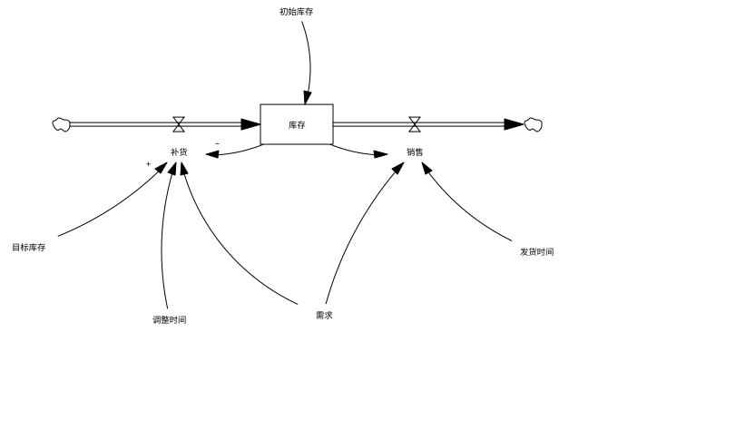

# Vensim System Dynamics Skill

[简体中文](README.md) · [English](README.en.md)

面向 Agent 的专业 Vensim 建模与仿真 Skill。直接处理可编辑的 `.mdl`，新建默认中文业务变量、中文视图和环形反馈布局，支持原生圆弧、影子变量避让、情景实验、参数校准、政策优化与 Python 论文图件。Windows、macOS、Linux 共用 Python 核心；MCP 是可选接入方式。

**最终模型结构图必须来自真实 MDL 在 Vensim 原生打开后的导出或截图。** Graphviz 只用于辅助定位；工具生成的几何预览不能代替原生图。项目为独立实现，与 Ventana Systems 无隶属或认证关系。

**作者：传康KK（万能程序员） · 禁止商业使用。** 使用与分发须遵守 [非商业许可证](LICENSE)，保留作者及许可证信息；作者署名放在文档中，不叠加到模型图上。

[安装](#安装与运行) · [目录与技能识别](#目录与技能识别) · [MDL 外观](#外观规则) · [Python 结果图](#python-论文结果图) · [实验能力](#仿真与新增实验能力) · [校准与优化](#python-参数校准与政策优化) · [Agent 接入](#agent-与-mcp) · [验收](#检查修复与开发)

## 目录与技能识别

```text
vensim-system-dynamics-skill/
├── README.md                         仓库说明与使用导航
├── LICENSE                           非商业许可
├── .github/workflows/validate.yml    跨平台与可选集成检查
├── docs/                             本仓库的验收记录与真实示例图
├── tests/                            解析、几何、仿真、绘图、MCP 回归
└── skills/vensim-skill/              可单独安装、分发的完整 Skill
    ├── SKILL.md                      标准技能入口，按任务加载说明
    ├── LICENSE                       分发时保留的许可证
    ├── skill.sh / skill.cmd          macOS/Linux 与 Windows 入口
    ├── agents/openai.yaml            名称、描述与默认调用提示
    ├── scripts/                      确定性建模、排版、仿真与绘图代码
    ├── references/                   按需阅读的操作、图面、绘图与研究规范
    ├── assets/templates/             建模、实验、布局和出图配置
    ├── assets/examples/              中文示例及历史格式回归样例
    └── requirements/                 按功能安装的可选依赖及版本约束
```

入口目录名与 `SKILL.md` 的 `name: vensim-skill` 一致，文件包含标准 YAML frontmatter。代码和资源都在同一个 skill 目录内，移动或安装后不依赖开发者的绝对路径。启动脚本根据自身位置找到代码，输入与输出路径则相对于调用时的工程目录。

核心不是固定的“库存模板”。[空白建模规范](skills/vensim-skill/assets/templates/model_template.json) 不预填研究参数；Agent 根据资料填写方程、单位、初值和时间设置，再调用工具。库存等数值样例用于演示和回归，不能当作其他任务的默认事实。

## 安装与运行

需要 Python 3.10+。检查、局部布局、建模、内置仿真只依赖标准库。Graphviz、绘图、PySD 和 MCP 按需安装。

```bash
npx skills add 1837620622/vensim-system-dynamics-skill --skill vensim-skill
```

支持 `gh skill` 的 GitHub CLI 也可安装：

```bash
gh skill install 1837620622/vensim-system-dynamics-skill vensim-skill --agent codex --scope user
```

本地开发或直接运行：

```bash
git clone https://github.com/1837620622/vensim-system-dynamics-skill.git
cd vensim-system-dynamics-skill/skills/vensim-skill
./skill.sh doctor
```

Windows PowerShell：

```powershell
cd vensim-system-dynamics-skill\skills\vensim-skill
.\skill.cmd doctor
```

也可跨平台直接执行 `python scripts/skill_cli.py doctor`。路径含空格时加引号。命令从当前 skill 目录运行，所有输出放入明确指定的工程目录。

| 可选功能 | 依赖 | 安装方式 |
| --- | --- | --- |
| 时间序列和实验结果图 | matplotlib | `python -m pip install -r requirements/plots.txt` |
| PySD 翻译与仿真 | pysd | `python -m pip install -r requirements/pysd.txt` |
| 参数校准与政策优化 | scipy | `python -m pip install -r requirements/analysis.txt` |
| 本地 stdio MCP | MCP Python SDK 1.x | `python -m pip install -r requirements/mcp.txt` |
| 全局节点位置建议 | Graphviz | macOS：`brew install graphviz`；Windows：使用 [官方安装包](https://graphviz.org/download/)，将 `dot` 加入 PATH |

安装 Vensim 请使用 [官方渠道](https://vensim.com/download/)，并遵守其独立许可。公开版本线为 Vensim 10.5，[官方会议资源](https://vensim.com/conference/) 注明 DSS 10.5.2；本机原生检查环境为 PLE 10.5.0。下载页与发布说明可能更新不同步，应核对实际产品通道与安装版本。平台自动化测试不等于每个版本的原生 UI 都已实测。

可选依赖引用 `requirements/constraints.txt` 中的已知安全修复下限，不要求核心安装整套科学计算或 MCP 包。`doctor` 会报告解释器、Graphviz、可选包、原生 Vensim 与中文绘图字体。中文绘图前还会按实际文字检查字形覆盖。

## 外观规则

- **新建默认环形布局。** 反馈链按实际连接沿环展开，外围参数就近放置；不同模块独立组织，SFD 的存量、阀门与实体管道保留骨架。不为凑圆形增删关系或把全部变量塞进同一个圆。
- 新图默认黑色信息箭头，纯蓝 `0-0-255` 为可选样式；去掉深蓝“学术配色”默认值。实体流量保持黑色双线与原生阀门。
- 对照原生箭头的颜色继承、线宽、头部、极性和延迟设置；颜色配置不得覆盖所选黑色/纯蓝方案，不强行放大箭头或加粗全部连线。
- 默认中文业务变量，用户指定英文时使用英文；既有模型保留原变量名。
- 存量—流量是稳定骨架；参数靠近作用对象，初值靠近存量。先局部避让，不把图铺成机械网格，也不加入随机抖动。
- 普通箭头按三点圆弧计算碰撞，避免把控制点错当 Bézier 手柄。双向关系分开走，优先无交叉、无穿字、无大跨度包围弧。
- 按 View 和对象 ID 处理影子实例；可移动的影子独立避让，保持引用身份与出线。影子入线报错，不能靠隐藏全部影子或合并同名对象掩盖冲突。
- 不在图上新增调试编号、生成过程、无依据的回路符号、作者水印和大段注释。已有必要的因果极性与延迟标记保留。
- 字体大小、文字边界、长变量名和影子括号一起检查；换字体后重新审图。布局按内容调整，不固定业务参数、不照搬示例坐标。

完整约束见 [SKILL.md](skills/vensim-skill/SKILL.md) 和 [图面规则与返工判据](skills/vensim-skill/references/APPEARANCE.md)。规则既约束 Agent 工作流，也有对应几何检查和不变量测试；不能承诺任意复杂网络自动得到零交叉结果。

Vensim 原生导出的库存示例（对应 [MDL](skills/vensim-skill/assets/examples/inventory_zh.mdl)，[验收记录](docs/native_example_verification.json)）：



新增环形反馈示例，直接由默认 `build` 生成并在 Vensim PLE 通过模型、单位和图面检查；下图是同一 MDL 的原生 SVG，没有用几何预览替代。参数位于其作用节点附近，主反馈沿环阅读。

该示例中的数值只用于演示和回归，未写入建模器的业务默认值。实际任务从空白规范开始；缺少方程、初值或时间范围时必须补充资料，不能自动加载本示例。


[可编辑 MDL](skills/vensim-skill/assets/examples/circular_feedback_zh.mdl) · [建模 JSON](skills/vensim-skill/assets/templates/circular_feedback_zh.json) · [原生验收与哈希](docs/circular_example_verification.json)

| 操作 | 默认方式 | 调整方法 |
| --- | --- | --- |
| 新建模型 | `build` 自动采用 `circular` | JSON 中 `sketch.layout_mode` 可改为 `refine` 或 `preserve` |
| 已有图局部修复 | `layout` 默认 `refine`，保留人工结构 | 需要环形重排时加 `--mode circular` |
| 留白和形状 | 按节点数、实际文字框和连接计算半径 | `circular_gap`、`circular_aspect`、`node_spacing` 可配置 |
| 人工坐标 | 新建 `position` 固定不动 | 已有图用 `node_positions`；其他节点避开锚点 |
| 无法自动消除的冲突 | 报告具体对象，保留真实关系 | 在原生软件调整、拆 View 或核对合法影子引用 |

```bash
./skill.sh build model.json --output work/model.mdl
./skill.sh layout existing.mdl --output work/circular.mdl --mode circular --style monochrome
```

环形布局使用 Python 标准库，不要求 Graphviz。它是本 Skill 的显示默认，不代表 Vensim 官方要求所有模型都呈正圆，也不自动证明回路性质。

## 从中文模型到实验结果

```bash
./skill.sh build assets/templates/inventory_zh.json --output work/inventory.mdl
./skill.sh check work/inventory.mdl
./skill.sh visual work/inventory.mdl --strict --max-crossings 0
./skill.sh simulate work/inventory.mdl --var 库存 --var 补货 --output results/base.csv
./skill.sh graph work/inventory.mdl --var 库存 --output results/stock.png
./skill.sh experiment work/inventory.mdl --spec assets/templates/inventory_scenarios.json --output-dir results/scenarios --plot results/scenarios.png
./skill.sh experiment work/inventory.mdl --spec assets/templates/inventory_sensitivity.json --output-dir results/sensitivity
./skill.sh convergence work/inventory.mdl --var 库存 --output results/convergence.json
```

在 Vensim 打开 `work/inventory.mdl`，执行 `Check Model` 和 `Units Check`，运行模型并核对结果，再从软件中导出结构图。上面的 Python 图是仿真结果曲线，与模型结构图是不同交付物。

建模规范明确每个存量的初值和单位、每个流率的来源/去向与方程，以及辅助量。可以给存量和辅助量设置 `position: [x, y]`，保留人工确定的位置。工具不会推断真实世界的参数值、因果极性或研究结论。库存示例仅用于演示，不是经数据校准的预测模型。

必须显式提供完整 `time` 设置。新模型的业务变量、视图名默认中文；原生函数和控制变量保留 Vensim 语法。`sketch.font_family` 和 `sketch.font_size` 可按实际 Vensim 环境调整，文字框同步估算，最终由原生审图确认。字段见 [输入规范](skills/vensim-skill/references/SPECIFICATIONS.md)。

## 正负极性与反馈符号

新增 `feedback` 命令与 MCP `check_feedback`。检查真实 MDL 中已标注的 `+/-/S/O` 是否符合方程方向，并核对建模 JSON 的 `feedback_loops` 有向路径与 `R/B`。新建时，可确定的符号冲突会阻止输出；复杂非线性与取值范围尚不明确的关系报告待核对，不按变量名猜答案。

```bash
./skill.sh feedback work/model.mdl --spec model.json --output review/feedback.json
./skill.sh feedback work/model.mdl --spec model.json --strict
```

正负号靠近所属箭头的目标端空白侧，R/B 放在对应回路内部留白；不压字、不遮线、不把多个回路符号堆在圆心。原生支持箭头头部/控制柄、弧内/弧外位置。程序保留这些原生字段，最终位置必须在实际 Vensim 图面确认，不能用几何预览代替。

增强/平衡由动态依赖及链接符号决定，与顺逆时针无关；初值关系不能补成动态回路，负反馈也不保证没有振荡。当前参数下的静态符号检查不能代替所有取值范围与研究机制的验证。详细用法与边界见 [反馈核对手册](skills/vensim-skill/references/FEEDBACK.md)。

## Python 论文结果图

默认使用 Python 生成仿真结果图，参考经典 Vensim 文献图的表达方式：白底、细实线网格、曲线上重复编号、图下逐行长线图例。**默认无标题、图号、图标、图集装饰和水印**。每个变量独立成图，多个情景在同一变量下比较。

**仿真图默认彩色，单条曲线和 Monte Carlo 分位带也使用彩色。** 蓝、朱红、绿、紫等颜色区分情景；编号和可配置线型辅助识别，图例同步。密集处的编号在真实采样点间避让，不能移动曲线数据。`colors`、`show_grid`、`line_styles` 与分位带透明度均可配置；模型结构图继续使用黑色／纯蓝原生箭头。


图中数据来自随仓库提供的库存 MDL：只扰动“调整时间”，每次从相同初值重跑，保留原基准。曲线使用实际 Euler 序列，不根据参考图片描点，也不为美观改变结果。

```bash
./skill.sh experiment work/inventory.mdl --spec assets/templates/inventory_perturb.json --output-dir results/perturb --plot results/perturb/stock.png --formats png,pdf,svg
./skill.sh plot-data results/perturb/series.csv --var 库存 --time-unit Month --output figures/stock.png --dpi 1200
./skill.sh graph work/inventory.mdl --var 库存 --output figures/stock.pdf --plot-config assets/templates/plot_config_classic.json
```

| 细节 | 默认行为与可调整项 |
| --- | --- |
| 位图 | PNG 600 DPI；`--dpi 1200` 可提高输出像素，设置资源上限避免异常大图 |
| 矢量 | `--formats png,pdf,svg` 同时导出；PDF/SVG 适合论文排版和缩放 |
| 字体 | 按系统选择；检查实际字形，SVG 字形转路径、PDF 嵌入字体 |
| 图例 | 变量与情景逐行对应，编号和颜色与曲线一致；过长时提示调整 |
| 可配置样式 | 尺寸、字体、字号、线宽、色表、网格、编号大小和重复密度 |
| 多变量 | 分别输出编号文件，在 `.plot.json` 记录变量与文件映射 |
| 大量敏感性运行 | 中位数与 25–75% / 5–95% 样本区间；可选择分组经典曲线 |
| 数据核验 | 拒绝重复时间、缺失字段、NaN/Inf、诊断替代值和不一致的分位带时间网格 |

经典编号样式是可调整的起点。用户给定期刊、字号或版面要求时按其规范配置，不把一种字体或固定参数强加给所有项目。完整教程、CSV 格式、百分比扰动与图件追溯见 [结果图手册](skills/vensim-skill/references/RESULT_PLOTS.md)。

## 整理已有 MDL

```bash
./skill.sh inspect original.mdl
./skill.sh audit original.mdl
./skill.sh layout original.mdl --output work/reviewed.mdl --mode refine --style monochrome
./skill.sh visual work/reviewed.mdl --strict --max-crossings 0
```

| 模式 | 行为 | Graphviz |
| --- | --- | --- |
| `preserve` | 节点不动，整理支持的信息圆弧 | 不需要 |
| `refine`（默认） | 就近避让辅助量和影子重叠，整理圆弧 | 不需要 |
| `circular` | 按实际连接组织反馈环与外围参数，保留固定骨架 | 不需要 |
| `auto` | 比较原图、局部方案和 Graphviz 位置建议 | 有可移动节点时需要 |
| `graphviz` | 明确采用全局节点位置建议，再按原生圆弧路由 | 需要 |

默认样式 `preserve` 保留原颜色；统一黑色用 `monochrome`，纯蓝信息箭头用 `native-blue`。支持的单控制点信息线可重路由；未知、多点、正交等路由的端点保守锁定，另行原生核验。管道、阀门和附着流量文字默认不移动。

使用 `--config` 读取 [SFD 配置](skills/vensim-skill/assets/templates/layout_config_sfd.json)。`lock_node_names`、`lock_object_ids` 保护人工位置；`move_shadows` 控制影子避让；`node_positions` 指定唯一可移动变量的坐标。

输出为新 MDL 和 `.mdl.layout_report.json`。报告包含方程哈希、编码、拓扑校验、前后碰撞、交叉、影子实例和未支持的形状。输入文件不覆盖，因此不会在原目录生成冗余 `.backup.mdl`。

如需调试，可另外运行：

```bash
./skill.sh preview work/reviewed.mdl --compare-with original.mdl --output debug/geometry.html
```

这个预览明确标记 `eligible_as_final_model_figure: false`。正式交付时不把它当作结构图。

## 仿真与新增实验能力

| 能力 | 输出或边界 |
| --- | --- |
| 内置标量仿真 | Euler；INTEG、常见数学函数、条件、Lookup、平滑和延迟子集 |
| 可选 PySD | `--backend pysd`；本封装仅处理自包含标量模型，外部数据和高级模型需原项目 PySD/原生 Vensim |
| 常量覆盖 | `--set '调整时间=2'`；不修改 MDL，不覆盖存量、控制变量或反馈方程 |
| 时间设置 | `--time-step`、`--final-time`、`--saveper`；记录实际有效值 |
| 情景实验 | 每个情景从原始初值重新开始，参数与结果可追溯 |
| 单因素百分比扰动 | 从 MDL 读取基准常量，逐个改变指定参数并保留基准；支持自定义变化幅度 |
| 网格敏感性 | 参数笛卡尔积，限制总运行规模 |
| Monte Carlo | 固定种子、独立均匀分布；不宣称样本范围是统计置信区间 |
| 步长检查 | 对比 dt、dt/2、dt/4；同一保存时间网格上评估归一化误差 |
| 观测数据校准 | 显式参数边界、观测单位、权重和尺度；从真实 CSV 计算误差，实际运行候选模型 |
| 有约束政策搜索 | 终值、极值、均值或积分等目标，支持上下界约束；分别报告可行性、收敛和预算终止 |
| 结果文件 | 带 BOM 的 UTF-8 CSV；运行元数据、模型 SHA-256、后端、种子和参数 |

实验保存 `series.csv`、`summary.csv` 和 `experiment.json`；摘要包括初值、末值、最小值、最大值和峰值时刻。现有目录中同名输出不会被实验命令覆盖。批量实验最多 200 次，输出规模有上限。

`SMOOTH3` 和 `DELAY3` 使用三阶段状态；物料延迟按各阶段的流出传递，避免错误地把上游存量当作下游流入。默认严格求值；不支持的函数和无效参数会报错。`--keep-going` 仅用于诊断，其结果不适合用于研究结论。

`check` 是内置预检，`units` 只检查缺失单位，均不能代替原生量纲验证。复杂数组、宏、外部数据、随机函数及完整 Vensim 函数语义不在内置求解器承诺范围内。

## Python 参数校准与政策优化

PLE 用户可以借助 Python 完成这两类高级分析。SciPy 差分进化负责搜索，内置引擎或 PySD 负责每次仿真。每次都从原始初值开始，保存基准与最佳可行方案；源 MDL 的方程、原始参数和图面保持不变。

```bash
python -m pip install -r requirements/analysis.txt
./skill.sh calibrate work/model.mdl --spec calibration.json --data observations.csv --output-dir results/calibration
./skill.sh optimize work/model.mdl --spec policy.json --output-dir results/policy
./skill.sh plot-data results/calibration/comparison.csv --var 目标变量 --time-unit 实际单位 --output figures/calibration.png --formats png,pdf,svg
```

这里的模型、规范、观测文件、变量和单位由当前工程提供。使用 [校准模板](skills/vensim-skill/assets/templates/calibration_template.json) 和 [政策模板](skills/vensim-skill/assets/templates/policy_template.json) 填写资料；模板不预设业务参数、目标、随机种子或次数。空值不能直接运行。

| 项目 | 参数校准 `calibrate` | 政策优化 `optimize` |
| --- | --- | --- |
| 依据 | 实际观测 CSV，变量及时间单位明确 | 明确的政策目标、方向、尺度与约束 |
| 得分 | 加权、归一化的均方误差 | 加权统计目标，分别指定最小化/最大化 |
| 参数 | 有界数值常量，可包含独立初值参数 | 有界可调常量，不能替换反馈方程 |
| 时间 | 观测必须落在实际保存网格，不静默插值 | 所有方案使用同一时间区间与保存网格 |
| 约束 | 严格检查数据字段、单位声明、有限值 | 支持变量初值、终值、极值、均值或积分的上下界 |
| 结果 | baseline、best、observed 的对应轨迹 | baseline 与最佳可行方案的对应轨迹 |

每次输出 `optimization.json`、`evaluations.csv`、`baseline.csv`、`comparison.csv`；找到可行解才生成 `best.csv`。报告记录源文件哈希、后端、NumPy/SciPy 版本、参数、实际仿真次数及终止原因。无可行解仍保留审计记录，不编造最优方案；重复运行使用新的目录。

`seed` 与 `max_evaluations` 必须显式给出，实际次数包含基准且不会超过设置上限。默认资源保护可在评估机器能力后调整。找到可行解、预算耗尽、求解器收敛分别记录，**不把搜索所得最好结果称为已证明的全局最优**。

这两项能力覆盖 Vensim 高级版本中校准与政策搜索的使用场景，属于独立实现。保存点上的梯形积分与 DSS 原生 payoff 累积规则不同，不能宣称分数逐位等价。暂不实现 Kalman 滤波、MCMC、参数置信区间或 DSS 全部优化选项。输入字段、计算定义、输出和验证方法见 [Python 高级分析手册](skills/vensim-skill/references/ADVANCED_ANALYSIS.md)。

## Agent 与 MCP

能读取技能文件、运行本地 Python 命令的 Agent 可调用 CLI；具体宿主能力仍应实际检查。核心不依赖某个 IDE，也不要求启动服务器。

可选独立 stdio 适配器提供 13 个固定工具：读取模型、方程预检、几何检查、反馈极性检查、布局、建模、仿真、批量实验、参数校准、政策优化、结果绘图、步长检查、调试预览。它限定工作目录、拒绝路径越界及覆盖已有主输出和报告，不接受任意 shell 命令。旧于已声明安全下限的 MCP SDK 会拒绝启动并提示更新。启动方式与客户端配置见 [MCP 文档](skills/vensim-skill/references/MCP.md)。

后续可以直接这样给 Agent 任务：

> 使用 `$vensim-skill`，根据我的资料建立中文 MDL。先核对方程、单位、初值和参数来源，再安排存量流量骨架与自然连线，检查影子重叠。在原生 Vensim 审图，运行基准及与研究问题相关的实验，用 Python 输出无标题的清晰图件，并保留模型与结果的对应记录。

这是一段调用范式，不固定研究对象、模型规模、业务数值或实验幅度。只修图时可以直接提供 MDL 和具体问题；完整研究才使用相应研究检查，不把无关步骤强加给简单任务。

Ventana 的 [官方会议资源页](https://vensim.com/conference/) 已提供 **VenAgent / VensimMCP / VentityMCP 的 Windows 与 Mac 包入口**，工作坊使用 DSS 10.5.2。这里的适配器是独立实现；PLE 安装不代表已有官方 MCP。官方组件的许可、安装和工具能力仍须按实际环境核对，本仓库未声称已实测官方服务器。

## 检查、修复与开发

```bash
./skill.sh units model.mdl
./skill.sh fix model.mdl --units-map units.json --output work/units_fixed.mdl
./skill.sh academic model.mdl --references refs --spec research_spec.json
```

`fix` 不再猜测缺失单位：单位表由用户或研究依据明确提供。断裂箭头删除需显式 `--drop-broken-arrows`，不能代替语义修复。研究专项要求见 [研究工作流](skills/vensim-skill/references/RESEARCH_WORKFLOW.md)。

从仓库根目录运行：

```bash
PYTHONDONTWRITEBYTECODE=1 python3 -m pytest -q -p no:cacheprovider
python3 -m ruff check .
python3 -m ruff format --check .
python3 -m bandit -r skills/vensim-skill/scripts -q
shellcheck skills/vensim-skill/skill.sh
```

Windows 测试用 `python -m pytest -q -p no:cacheprovider`。CI 已配置 Windows、macOS 与 Linux 矩阵；可选 PySD/MCP/Matplotlib/SciPy 集成检查在安装对应依赖的任务中运行。配置存在不等于远程测试已通过，实际执行状态见 [GitHub Actions](https://github.com/1837620622/vensim-system-dynamics-skill/actions/workflows/validate.yml)，每次发布分别说明本机与远程验证情况。解析、真实圆弧、编码续行、影子重叠、不变量、求解器、校准和约束优化、绘图、技能识别和输出路径是主要回归范围。

原生验收已经覆盖中文库存示例的模型检查、单位检查、原生 SVG 与库存轨迹的可视检查；内置引擎与 PySD 对相同示例做逐点数值对照。原生轨迹的可视检查不等同于原生全量数值误差验证，验收记录明确区分这些证据。

## 文献、方程与图件的一致性

新增 [学术表达与文献依据](skills/vensim-skill/references/ACADEMIC_PRESENTATION.md)，对照 Sterman 的反馈图方法、Rahmandad 与 Sterman 的仿真研究报告规范、MIT 存量流量教材和 Vensim 原生文档。整理了反馈图、完整方程表、初值与单位、情景曲线、敏感性图和图例的检查方法。

文献提供表达和验证依据；业务方程、参数、实验幅度仍从当前任务取得。数学符号、中文 MDL 名称、CSV 列和图例保持对应。代码不会为了拟合参考图的外形修改仿真数值；原生检查、跨后端数值比较与研究有效性分别报告。

## 兼容性与升级说明

`v2.2.1` 补齐完整英文 README，并由 `pyproject.toml` 统一 Python 3.10 的类型语法、导入顺序、异常链、闭包与格式检查。CI 同时检查 Ruff lint 和 format；代码规范由工具验证。

`doctor` 新增当前解释器的依赖约束检查，报告缺少包、低于修复下限和待核对版本。它读取随 Skill 分发的 `requirements/constraints.txt`，不以重新解析的新版本代替本机实际版本检查，也不宣称是实时漏洞库扫描。原有全局 Python 环境不自动改动。

本轮审查修复官方函数与数据身份边界：`ZIDZ(A,B)` 使用正确的两个参数，XIDZ/ZIDZ 按绝对分母小于 `1e-6` 的原生规则保护除法；`PULSE` 处理零宽度与官方半步比较；`DELAY FIXED` 保存独立状态，延迟时间和初值只在初始化读取，支持延迟反馈与离散步长取整，拒绝嵌入其他表达式。固定延迟已对照 PySD 验证；各后端的非网格脉冲时刻等边界仍须按模型核对，不能据此宣称全部函数逐位等价。

名称解析遵守大小写不敏感、空格与下划线等价的原生规则，并拒绝等价重复定义。Lookup 支持原生独立表和 `WITH LOOKUP`，显示范围与参考点不参加插值，科学计数法可识别，乱序、重复和非有限点会报错。历史查表示例的括号也已修正，数值点保持不变。嵌套条件中的内部别名与真实变量重名问题有单独回归。

CSV 与相邻运行清单现在通过 SHA-256 对应；`plot-data` 恢复诊断状态、时间单位和实验类型，拒绝哈希不符及只改时间单位标签。旧 CSV 或无清单的第三方 CSV 仍可绘图，但标为来源未验证；缺少清单不代表原生验证。MCP 会在解析输出路径前拒绝断裂符号链接。完整范围、修复与未验证项见 [审查记录](docs/AUDIT.md) 和 [仿真语义边界](skills/vensim-skill/references/SIMULATION_SEMANTICS.md)。

`v2.2.0` 新建默认环形反馈布局，CLI、Python 和 MCP 共用相同规则；外围参数就近放置，多模块和影子实例独立安排。新增原生环形示例、文献表达手册、彩色单曲线与分位带、编号避让、线型与网格配置。新增箭头极性和指定反馈回路检查，可确定的正负号或 R/B 冲突会阻止新建；复杂关系及原生符号位置分别记录待核对状态。

同时修复四类问题：显式建模位置被后续排版移动；其他节点未避开锚点的新位置；实体管道穿字未计入几何失败；布局字段将布尔值或非整数误当作坐标、间距或次数。命名政策情景过多时现在提示分组，只有明确的 Monte Carlo 运行才自动转为样本分位带，避免丢失情景身份。

`v2.1.0` 增加观测校准、有约束政策搜索、两份不含业务数值的规范模板和两个 MCP 工具。同时修复原生颜色方案被自定义色覆盖、内部变量别名与真实变量重名导致的数值错误，以及附属报告、图件清单可能覆盖既有文件的问题。

- 公共入口仍为 `skill.sh`、`skill.cmd` 和 `SKILL.md`；内部执行路径统一为 `scripts/`，资料放 `references/`，示例与模板放 `assets/`。旧脚本中引用内部目录的路径需要同步更新。
- 新建模型和仿真必须有完整时间设置；实验幅度、抽样次数、种子显式提供，不静默套用旧案例。新建 MDL 默认中文，已有变量名保持。
- 新建默认环形；已有图默认局部布局与样式保留。可明确选择黑色或原生纯蓝。影子实例独立处理，重复 Defined、错误入影子线和不支持的几何形状会报告。
- 方程区逐字节保护、BOM/GB18030/续行兼容、箭头极性与延迟标记保留、三阶段物料延迟和状态初始化都有回归覆盖。
- 结果图统一为可配置 Python 绘图，默认 600 DPI 与独立单变量图件；多变量不再机械拼成一张长图集。
- 项目输出放明确的 `work/`、`results/` 或用户工程目录；Python 缓存、临时 Vensim 数据集和调试文件不作为 Skill 源码发布。
- 主输出与附属文件一起检查；默认拒绝覆盖所有已有输出及断裂符号链接。写入采用同文件系统的原子新建，要求输出位置支持硬链接（例如常用 APFS、NTFS、ext4）。不支持的文件系统会报错，应改用本地工程目录；不会退回静默覆盖。

本项目补充 PLE 外的实验与出图工作流，**不解锁 DSS，也不替代 DSS 全部功能**。所有后端都应按模型实际使用的函数、数据源、数组和积分方式确认支持情况；遇到未覆盖语法要报错或切换后端，不静默近似为“正确结果”。

更多命令见 [操作手册](skills/vensim-skill/references/OPERATIONS_GUIDE.md)，格式和算法来源见 [参考资料](skills/vensim-skill/references/REFERENCES.md)。仓库保留早期示例用于兼容测试，不代表每个历史示例都已完成最新原生图面验收。

## 作者与许可

- 作者：**传康KK（万能程序员）**
- GitHub：[1837620622](https://github.com/1837620622)
- 微信：1837620622（传康Kk）
- 邮箱：2040168455@qq.com
- 咸鱼 / B站：万能程序员

当前代码及文档按 [非商业许可证](LICENSE) 提供，禁止商业使用、付费分发、收费服务集成或商业客户交付。复制和非商业修改须保留署名与许可证。第三方软件使用各自许可证；此前已按其他许可证发布的版本继续按其随附条款处理。
